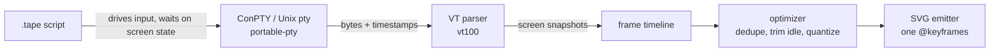

# ttysvg

Record your terminal, get one animated SVG you can drop straight into a README.

<p align="center">
  
</p>

That image is a single file. No JavaScript, no video, no external requests. The text
in it is real text, so it stays sharp at any zoom and you can select and copy it. It
also carries a light palette and a dark palette at once, so it matches whichever theme
the reader is using.

It works on Windows, which is the reason this project exists.

## What you get

- **One file.** A `.svg` you commit next to your code. GitHub renders it inline.
- **Small.** A typical recording is 20 to 100 KB. The same thing as a GIF is several megabytes.
- **Sharp forever.** Vector text, not pixels. Zoom in as far as you like.
- **Theme aware.** One file looks correct on both the light and dark versions of a page.
- **Repeatable.** Write your demo as a short script and regenerate it whenever your output changes.

## Why this exists

A command line tool is judged by the demo at the top of its README. If you develop on
Windows, there was no good way to make one.

| Tool | Why it does not work on Windows |
|---|---|
| asciinema | Unix only. There is no Windows recorder, because it depends on a Unix pty. |
| VHS | Requires ttyd and ffmpeg. The Windows path is unofficial and breaks easily. |
| svg-term-cli | Unmaintained, and it needs an asciinema recording as its input. |
| Screen capture to GIF | Multi megabyte, blurry when scaled, wrong colors in dark mode, and a single typo means recording the whole thing again. |

`ttysvg` talks to the Windows pseudo console (ConPTY) directly. The same code runs on
macOS and Linux through a normal pty, so a project can use one tool everywhere.

## Install

You need [Rust](https://rustup.rs). On Windows you also need Windows 10 version 1809 or
newer, which is when ConPTY arrived.

```
git clone https://github.com/Nuu-maan/ttysvg
cd ttysvg
cargo install --path .
```

That puts `ttysvg` on your PATH. To try it without installing, use `cargo run --` in
place of `ttysvg` in any command below.

## Your first recording

Run a program and record it. Everything works normally while it runs, and the file is
written when the program exits.

```
ttysvg record --out demo.svg -- cargo build
```

Recording an interactive shell works the same way. Type whatever you want, then `exit`.

```
ttysvg record --out demo.svg -- powershell -NoLogo
```

Open `demo.svg` in a browser to check it, then commit it and reference it from your
README:

```markdown

```

## Making it repeatable

Recording by hand is fine once. The problem comes later, when your output changes and
every demo in the repo is out of date.

A tape fixes that. It is a small script describing the demo, so you can regenerate the
recording any time with one command.

```
ttysvg build demo.tape
```

Here is a complete tape with every line explained:

```tape
output "demo.svg"           # where to write the result
theme  "tokyonight"         # built in theme name, or a path to your own
width  80                   # recording size in characters, not pixels
height 20
window on                   # draw a title bar with traffic lights
title  "demo"

shell "powershell.exe" "-NoLogo" "-NoProfile"

type-delay 55ms             # pause between keystrokes, so typing looks human
trim-idle  700ms            # cut any dead air longer than this
tail       2s               # hold the last frame this long before looping

wait  "PS " 20s             # block until the prompt appears, up to 20 seconds
type  "cargo build"         # type it out, one character at a time
sleep 400ms
enter
wait  "Finished" 60s        # block until the build actually finishes
sleep 1s
```

`wait` is the part that matters most. It blocks until that text really appears on the
screen. A fixed `sleep` guesses, and the guess is wrong the first time the machine is
busy, which is how scripted demos end up cut off halfway. `wait` cannot desynchronize.

Once you have a tape, rebuilding in a different theme costs nothing:

```
ttysvg build demo.tape --theme gruvbox --out demo-gruvbox.svg
```

There are complete tapes for nine common situations under [Examples](#examples), from a
README banner to a full screen TUI to a deploy that must not leak its credentials.

## Recording once and restyling forever

Rebuilding a tape re-runs your command, which takes as long as the command takes and
depends on the machine still being in the same state. If all you want to change is how
the recording looks, save the capture instead:

```
ttysvg record --out demo.svg --save demo.json -- cargo build
```

`demo.json` holds the terminal frames and their timing, not the SVG. Every style and
timing choice can then be replayed against it with no terminal involved:

```
ttysvg render demo.json --theme gruvbox
ttysvg render demo.json --speed 2 --window --title "cargo build"
ttysvg render demo.json --info
```

This is the difference between a two second loop and a two minute one. Rendering reads
the saved frames straight from disk, so it finishes in milliseconds however long the
original command took. Re-rendering with no flags reproduces the original SVG byte for
byte, because the recording stored the settings it was made with.

Both other commands can save one, and `--save` on its own skips the SVG entirely:

```
ttysvg record --save session.json -- ./my-tool
ttysvg build demo.tape --save demo.json
```

## Recording something real

A recording is a publishing format. Whatever was on screen ends up in a file that goes
into a README, and a capture stores it as plain readable text. Two flags exist so that
does not become a problem.

```
ttysvg record --sanitize --redact "sk-[A-Za-z0-9]+" --out demo.svg -- ./deploy
```

`--sanitize` handles the boring case with no regex. It rewrites your home directory to
`~`, and replaces your username and hostname with `user` and `host`. That alone covers
most of what makes people delete a demo and record it again.

`--redact` takes a regex and masks every match with `*`, and can be repeated. Use it for
anything shaped like a secret:

```
--redact "sk-[A-Za-z0-9]+"        # OpenAI style keys
--redact "ghp_[A-Za-z0-9]+"       # GitHub tokens
--redact "Bearer [A-Za-z0-9._-]+" # authorization headers
```

In a tape the same two settings are directives:

```
sanitize on
redact "sk-[A-Za-z0-9]+"
redact "ghp_[A-Za-z0-9]+"
```

Redaction runs the moment a frame is captured, before anything is written, so a masked
secret is never in the SVG or the capture. It also covers the command line itself, which
matters when the secret is an argument rather than output. Masking keeps the original
character count, so the layout does not move.

If you already have a capture that was recorded without it, the same flags work on
`render` and will clean the output without re-running anything:

```
ttysvg render session.json --sanitize --redact "sk-[A-Za-z0-9]+"
```

That cleans the SVG it writes. It does not rewrite the capture file, so delete that too
if it already holds something it should not.

## Command reference

### ttysvg record

Captures a live session. Stops when the program exits.

| Flag | Default | Meaning |
|---|---|---|
| `--out` | `demo.svg` | Output path |
| `--save` | off | Also write the raw capture, for `ttysvg render` |
| `--redact` | none | Mask everything matching this regex, repeatable |
| `--sanitize` | off | Rewrite the home directory, username and hostname |
| `--cols` `--rows` | your terminal size | Recording size in characters |
| `--theme` | `tokyonight` | Theme name or path to a theme file |
| `--font` | system monospace stack | CSS font family used in the output |
| `--font-size` | `14` | Pixels |
| `--padding` | `18` | Pixels of space around the content |
| `--window` | off | Draw a title bar |
| `--title` | empty | Text shown in the title bar |
| `--trim-idle` | `1s` | Collapse pauses longer than this, or `off` to keep real timing |
| `--speed` | `1.0` | Playback multiplier, so `2` is twice as fast |
| `--tail` | `2s` | How long the final frame holds before the loop restarts |
| `--no-loop` | off | Play once instead of looping |
| `--advance` | auto | Override character width in pixels, see Known limits |
| `--line-height` | auto | Override line height in pixels |

Everything after `--` is the command to record.

### ttysvg build

Runs a tape. Any flag given here overrides the tape.

| Flag | Meaning |
|---|---|
| `--out` | Output path |
| `--save` | Also write the raw capture, for `ttysvg render` |
| `--redact` `--sanitize` | Added to whatever the tape already sets |
| `--theme` | Theme name or path |
| `--speed` | Playback multiplier |
| `--window` | Force the title bar on |
| `--title` | Title bar text |

### ttysvg render

Rebuilds an SVG from a saved capture. Nothing is executed. Anything not given keeps the
value the recording was made with.

| Flag | Default | Meaning |
|---|---|---|
| `--out` | the capture path with an `.svg` extension | Output path |
| `--info` | off | Print what the capture holds and exit |
| `--theme` `--font` `--font-size` | as recorded | Same meaning as on `record` |
| `--padding` `--advance` `--line-height` | as recorded | Same meaning as on `record` |
| `--trim-idle` `--speed` `--tail` | as recorded | Retime without re-running anything |
| `--window` `--no-window` `--title` | as recorded | Title bar, either direction |
| `--no-loop` | as recorded | Play once instead of looping |
| `--redact` `--sanitize` | none | Clean a capture that was recorded without them |

### ttysvg themes

Lists the built in themes.

### Tape directives

Settings, valid anywhere in the file:

| Directive | Example |
|---|---|
| `output` | `output "docs/demo.svg"` |
| `theme` | `theme "catppuccin"` |
| `width` `height` | `width 90` |
| `font` | `font "JetBrains Mono" 14` |
| `font-size` `padding` | `padding 20` |
| `advance` `line-height` | `advance 8.4` |
| `shell` | `shell "bash" "-i"` |
| `window` `title` `loop` | `window on` |
| `trim-idle` `tail` `speed` | `trim-idle 500ms` |
| `type-delay` | `type-delay 40ms` |
| `redact` | `redact "sk-[A-Za-z0-9]+"` |
| `sanitize` | `sanitize on` |

Actions, run in order:

| Directive | Example |
|---|---|
| `type` | `type "cargo build"` |
| `wait` | `wait "Finished" 30s` |
| `sleep` | `sleep 1.5s` |
| `enter` `tab` `backspace` `escape` `space` | `enter` |
| `up` `down` `left` `right` | `down 3` |
| `ctrl` | `ctrl c` |

Key directives take an optional repeat count, so `down 3` presses it three times.
Durations accept `ms`, `s` and `m`, and a bare number means milliseconds. Lines
starting with `#` are comments. Backslashes inside quotes are literal, so Windows
paths like `type ".\scripts\build.ps1"` work as written.

## Examples

Every block below is a complete tape. Save it as `demo.tape`, run
`ttysvg build demo.tape`, and adjust the command in the middle to your own. They are
folded away so this page stays readable, so open only the one that matches what you are
trying to record.

<details>
<summary><b>A README banner for a command line tool</b></summary>

The most common case. A fixed size, a clean prompt with no machine name in it, and a
title bar so it reads as a terminal rather than a screenshot of text.

```tape
output "docs/banner.svg"
theme "tokyonight"
width 78
height 16
padding 20
window on
title "mytool"

shell "powershell.exe" "-NoLogo" "-NoProfile" "-NoExit" "-Command" "function prompt { 'mytool $ ' }; Clear-Host"

type-delay 55ms
trim-idle 700ms
tail 2500ms

wait  "mytool $" 20s
type  "mytool --help"
enter
wait  "USAGE" 10s
sleep 1500ms
```

The `wait "USAGE"` is doing the real work. It holds until your help text is actually on
screen, so the recording cannot end early on a slow machine.

</details>

<details>
<summary><b>A full screen TUI</b></summary>

Anything that draws a whole screen, moves the cursor around and redraws in place. This is
the case a naive recorder gets wrong, and the reason ttysvg keeps a real terminal grid
rather than replaying escape sequences.

```tape
output "docs/tui.svg"
theme "catppuccin"
width 100
height 30
window on
title "lazygit"

shell "powershell.exe" "-NoLogo" "-NoProfile" "-NoExit" "-Command" "Clear-Host"

type-delay 40ms
trim-idle 500ms

type  "lazygit"
enter
sleep 3s

down 3
sleep 900ms
right
sleep 1200ms
tab
sleep 1200ms

type  "q"
sleep 800ms
```

Give the program time to paint before sending keys. A TUI that is still starting up will
swallow the first keystroke, and the recording will look like the tool ignored you.

</details>

<details>
<summary><b>A long build or test run, sped up</b></summary>

Nobody wants to watch ninety seconds of compiler output at real speed, but cutting it
entirely loses the point. Speed up the playback and clamp the dead air.

```tape
output "docs/build.svg"
theme "gruvbox"
width 100
height 24
window on
title "cargo build --release"

shell "powershell.exe" "-NoLogo" "-NoProfile" "-NoExit" "-Command" "function prompt { '$ ' }; Clear-Host"

speed 3.0
trim-idle 400ms
tail 3s

wait  "$" 15s
type  "cargo build --release"
enter
wait  "Finished" 300s
sleep 2s
```

`speed 3.0` plays the whole thing three times faster. `trim-idle 400ms` separately caps
every gap, so a linker that stalls for twenty seconds becomes a short pause instead of a
frozen picture. The generous `300s` on the wait is a safety net, not a delay, since it
returns the moment the text appears.

</details>

<details>
<summary><b>An interactive prompt or wizard</b></summary>

Scaffolding tools, `npm init`, anything that asks questions. Arrow keys and enter, with
pauses so a viewer can read each question before the answer arrives.

```tape
output "docs/init.svg"
theme "nord"
width 84
height 20
window on
title "create-app"

shell "powershell.exe" "-NoLogo" "-NoProfile" "-NoExit" "-Command" "function prompt { '$ ' }; Clear-Host"

type-delay 60ms

wait  "$" 15s
type  "npm create vite@latest"
enter

wait  "Project name" 30s
sleep 800ms
type  "my-app"
enter

wait  "framework" 20s
sleep 1s
down 2
sleep 700ms
enter

wait  "variant" 20s
sleep 900ms
enter
sleep 2s
```

Wait on the question text rather than sleeping a fixed amount. Package managers vary
wildly in how long they take to show the first prompt.

</details>

<details>
<summary><b>A REPL session</b></summary>

Language demos, library tutorials, anything where the output of one line motivates the
next. A slower type delay makes it feel like a person is typing.

```tape
output "docs/repl.svg"
theme "tokyonight"
width 76
height 18
padding 22

shell "python" "-q"

type-delay 75ms
trim-idle 600ms
tail 3s

wait  ">>>" 15s
type  "import mylib"
enter
sleep 600ms

type  "mylib.parse('2 + 2 * 3')"
enter
wait  "8" 10s
sleep 1200ms

type  "mylib.explain(_)"
enter
sleep 2s
```

Note the shell is the REPL itself, with no wrapper. `wait ">>>"` catches the banner
finishing, and `wait "8"` proves the evaluation actually happened.

</details>

<details>
<summary><b>A deploy or anything holding credentials</b></summary>

The case where getting it wrong publishes a key. Redaction runs before anything is
written, so the secret is never in the SVG or in a saved capture.

```tape
output "docs/deploy.svg"
theme "gruvbox"
width 92
height 20
window on
title "deploy"

sanitize on
redact "sk-[A-Za-z0-9]+"
redact "ghp_[A-Za-z0-9]+"
redact "Bearer [A-Za-z0-9._-]+"
redact "[0-9]{1,3}\.[0-9]{1,3}\.[0-9]{1,3}\.[0-9]{1,3}"

shell "powershell.exe" "-NoLogo" "-NoProfile" "-NoExit" "-Command" "function prompt { '$ ' }; Clear-Host"

wait  "$" 15s
type  "./deploy.ps1 --env production"
enter
wait  "deployed" 120s
sleep 2s
```

`sanitize on` covers your home directory, username and hostname without a regex. The
patterns cover the rest, including the server address. Open the finished SVG and read it
before pushing, since a secret split across two colors by a syntax highlighter is not
matched.

</details>

<details>
<summary><b>Explaining an error, not just a success</b></summary>

The most useful recordings in a bug report or a tutorial show the failure first. Two
commands in one take, with a pause long enough to read the message.

```tape
output "docs/fix.svg"
theme "catppuccin"
width 88
height 22
window on
title "the fix"

shell "powershell.exe" "-NoLogo" "-NoProfile" "-NoExit" "-Command" "function prompt { '$ ' }; Clear-Host"

type-delay 50ms
trim-idle 800ms
tail 4s

wait  "$" 15s
type  "mytool build"
enter
wait  "error" 60s
sleep 2500ms

type  "mytool build --target wasm32-unknown-unknown"
enter
wait  "Finished" 120s
sleep 2s
```

The long `tail 4s` holds the final state before the loop restarts, so the resolution is
on screen long enough to register.

</details>

<details>
<summary><b>A git workflow</b></summary>

Several short commands where the interesting part is the sequence rather than any one
output.

```tape
output "docs/git.svg"
theme "nord"
width 92
height 24
window on
title "git"

shell "powershell.exe" "-NoLogo" "-NoProfile" "-NoExit" "-Command" "function prompt { '$ ' }; Clear-Host"

type-delay 45ms
trim-idle 500ms

wait  "$" 15s
type  "git status --short"
enter
sleep 1500ms

type  "git add -A"
enter
sleep 800ms

type  "git commit -m \"add the parser\""
enter
sleep 1800ms

type  "git log --oneline -5"
enter
sleep 2500ms
```

Note the escaped quotes inside the commit message. Only `\"` and `\\` are escapes, so
Windows paths stay literal.

</details>

<details>
<summary><b>Linux and macOS</b></summary>

Same tool, different shell line. Everything after the terminal parser is platform
independent, so the rest of the tape is unchanged.

```tape
output "docs/demo-linux.svg"
theme "tokyonight"
width 84
height 20
window on
title "mytool"

shell "bash" "--norc" "-i"

type-delay 55ms
trim-idle 700ms
tail 2500ms

wait  "$" 15s
type  "export PS1='mytool $ ' && clear"
enter
sleep 600ms

type  "mytool --help"
enter
wait  "USAGE" 15s
sleep 1500ms
```

`--norc` keeps someone else's prompt theme out of your recording. Setting `PS1` and
clearing gives the same neutral prompt the Windows examples build with `function prompt`.

</details>

<details>
<summary><b>One recording, every theme</b></summary>

This one is not a tape. Record once, then render the same frames repeatedly. Useful for
picking a theme, and for a docs page that shows all of them without recording four times.

```
ttysvg record --save session.json --out docs/demo.svg -- mytool --help

ttysvg render session.json --theme tokyonight --out docs/tokyonight.svg
ttysvg render session.json --theme catppuccin --out docs/catppuccin.svg
ttysvg render session.json --theme gruvbox    --out docs/gruvbox.svg
ttysvg render session.json --theme nord       --out docs/nord.svg
```

Each render takes milliseconds because nothing is executed. The same trick gives you a
wide social preview and a compact README banner from one take:

```
ttysvg render session.json --font-size 18 --padding 32 --out docs/social.svg
ttysvg render session.json --font-size 12 --padding 12 --no-loop --out docs/inline.svg
```

Everything except `--cols` and `--rows` can change after the fact. Those are fixed at
record time because the text has already wrapped.

</details>

## Themes

```
ttysvg themes
```

Ships with `tokyonight`, `catppuccin`, `gruvbox` and `nord`. Each one defines a light
and a dark palette, and the SVG switches between them using `prefers-color-scheme`.

To use your own, write a TOML file and pass its path to `--theme`:

```toml
name = "mine"

[dark]
fg = "#c0caf5"
bg = "#1a1b26"
ansi = ["#15161e", "#f7768e", "#9ece6a", "#e0af68", "#7aa2f7", "#bb9af7", "#7dcfff", "#a9b1d6",
        "#414868", "#f7768e", "#9ece6a", "#e0af68", "#7aa2f7", "#bb9af7", "#7dcfff", "#c0caf5"]

[light]
fg = "#3760bf"
bg = "#e1e2e7"
ansi = ["#b4b5b9", "#f52a65", "#587539", "#8c6c3e", "#2e7de9", "#9854f1", "#007197", "#6172b0",
        "#a1a6c5", "#f52a65", "#587539", "#8c6c3e", "#2e7de9", "#9854f1", "#007197", "#3760bf"]
```

The 16 entries are the standard ANSI colors in order: black, red, green, yellow, blue,
magenta, cyan, white, then the same eight again in their bright forms.

## How it works



Escape sequences are never turned into SVG directly. The byte stream feeds a real
terminal grid that understands cursor movement, scroll regions, the alternate screen and
line wrapping, and each state of that grid is photographed into a frame. That is the
difference between recording a full screen TUI correctly and only recording `echo`
correctly.

The output stacks every frame vertically inside one clipped group and animates
`translateY` using a single `@keyframes` block with `step-end` timing. One CSS rule
drives the whole animation no matter how many frames there are, and frames of different
durations come for free.

Everything after the parser is platform independent, which is why the emitter is tested
against fixed byte streams with no terminal involved at all.

## Contributing

Contributions are genuinely welcome, including from people who have never written Rust
before. The codebase is small on purpose.

```
git clone https://github.com/Nuu-maan/ttysvg
cd ttysvg
cargo test
cargo run -- record --out demo.svg -- powershell -NoLogo
```

Where things live:

```
src/capture/    spawning a pty, reading it, running a tape against it
src/term/       terminal grid to Frame, the platform independent boundary
src/optimize.rs dedupe, trim idle, quantize, speed, tail
src/redact.rs   masking secrets and rewriting paths before anything is written
src/session.rs  saving and loading a capture, so it can be re-rendered
src/svg/        the emitter, themes, escaping
src/tape/       tape tokenizer and directives
themes/         one TOML file per theme
tests/          integration tests, including a snapshot of the emitter output
```

Good places to start, roughly easiest first:

- **Add a theme.** Copy a file in `themes/`, change the colors, add one line to the list in `src/svg/theme.rs`. No Rust knowledge needed beyond editing an array.
- **Add a tape directive.** One arm in the match in `src/tape/parse.rs`, plus a test.
- **Measured font metrics.** Right now character width is assumed rather than measured. This is the most valuable open problem in the project, see Known limits.
- **PNG or GIF export** via `resvg`, for places that still refuse SVG.
- **A GitHub Action** that runs `ttysvg build` on every tag so demos never go stale.

Before opening a pull request, run:

```
cargo test
cargo clippy --all-targets
cargo fmt
```

If you change the emitter, the snapshot test will fail on purpose. Review the diff, and
if the new output is correct, accept it with `cargo insta accept` or by setting
`INSTA_UPDATE=always`.

The code leans on naming and structure rather than comments. Please keep new code in the
same spirit, and put the explanation in the README or the pull request description where
people will actually read it.

Bug reports are just as useful as code. If a recording comes out wrong, attach the tape
and the resulting SVG, and say which terminal and Windows version you are on.

## Known limits

- **Redaction matches within one run of same styled text.** A secret is masked when it
  sits in a single stretch of one color on one line. If a syntax highlighter splits it
  across colors, or it wraps to the next line, the pattern will not see it as one string.
  Check the output before publishing rather than assuming a pattern caught everything.
- **A saved capture cannot be resized.** `ttysvg render` can change every visual and
  timing setting except `--cols` and `--rows`. A capture stores the terminal grid after
  wrapping, not the bytes that produced it, so reflowing to a new width would need the
  recording to be made again.
- **Character width is assumed, not measured.** The output uses a generic monospace font
  stack and assumes each character is 0.6 times the font size wide. If text drifts to the
  right across a long line, pin it with `--advance` or the `advance` tape directive.
  Embedding a subset font would fix this properly and is the top item on the roadmap.
- **Wide characters depend on the viewer's font.** CJK, emoji and box drawing are placed
  using the terminal grid's own width tracking, but a font that disagrees will still look
  off by a cell.
- **Long recordings make large files.** Heavy animation means many frames. `trim-idle` and
  `speed` are the levers, and dropping the frame rate of the recorded program helps more
  than either.

## License

MIT. See [LICENSE](LICENSE).
